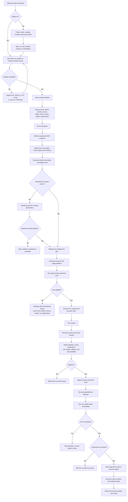
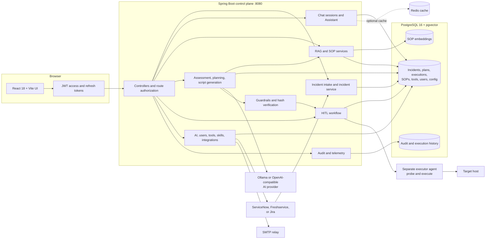

# Incident Warden

Incident Warden is a human-in-the-loop incident operations UI. It uses incident
records, SOP documents, saved remediation tools, and an AI provider to prepare
incident recommendations and remediation plans. A person reviews the proposed
script before it can be dry-run or executed.

## Current UI flow

Sign in and use the sidebar or command palette (`Cmd/Ctrl+K`):

```text
Assistant or Incident Dump
        |
        v
select an incident -> ask the Assistant to investigate or fix it
        |
        v
AI recommendation / remediation plan
        |
        v
HITL approval queue -> open the review console
        |
        v
read evidence, script, target, risk, and rollback
        |
        v
approve or reject -> dry run -> Execute for real
```

The Assistant and the incident pages do not bypass the approval gate. The
review console shows the exact script, its source, the plan hash, incident
context, and accountability information.

### Detailed remediation flow



### System architecture



The browser talks only to the control plane. The control plane owns planning,
authorization, persistence, guardrails, and audit records. It does not execute
shell commands or store target credentials. The executor agent is the separate
boundary that probes and runs an approved script on a target host.

For a runnable walkthrough, see [docs/demo-flow.md](docs/demo-flow.md). For a
presentation-oriented run sheet, see [docs/client_poc_demo.md](docs/client_poc_demo.md).

### Assistant

The Assistant is the home page. It supports:

- New Chat and saved chat history.
- Questions about incidents and operational knowledge.
- Incident lookup followed by AI analysis.
- Remediation planning for a selected incident.
- Missing-parameter collection when a plan needs more information.
- Script review and explanation before starting a run.

Signing in is required for actions that create plans or change incident state.

### Incident Dump

`Incident Dump` is the operational incident list. It supports:

- Search by ticket ID, host, subject, description, or text.
- Filtering by status, priority, and source.
- Importing CSV, JSON, or TXT incident dumps.
- ServiceNow, Freshservice, Jira, and generic ITSM import formats.
- Syncing configured ITSM feeds.
- Opening an incident to inspect its description, work notes, target, history,
  comments, graph context, and available attachments.

The current UI does not provide a general-purpose New Incident form. Incidents
come from imports, configured ITSM feeds, telemetry, or the API.

### HITL approval queue

The `HITL approval queue` is available to admin users. It lists plans awaiting
or completing human review and can be searched or refreshed.

Open a plan to see:

- Approved SOP evidence and matching incident precedent.
- Incident context, assignee, department, target, and connection details.
- Tool, action, risk, guardrail scan, script language, and script source.
- Script text, explanation, rollback plan, plan hash, and reviewer history.

Pending plans can be rejected with a reason or approved. Model-knowledge plans
without an approved SOP require an explicit acknowledgement that the whole
script was read. After approval, run `Dry run`; only a successful dry run
enables `Execute for real`.

### Tools

`Tools` manages saved remediation scripts. Create or edit a tool with:

- Tool name, description, category, and script language.
- Python, Shell, or PowerShell source.
- Optional AI code generation from a short prompt.
- Issues or symptoms the tool handles.
- Information required to run it.
- Rules for interpreting success, failure, and escalation.
- A validated-in-dry-run flag.

Tools can be searched, edited, and deleted. Deleting a tool also removes its
associated categorization, extraction, and execution skill definitions.

### SOP library

`SOP library` stores the documents used for grounded operational assistance.
Create or edit an SOP by either:

- Uploading a `.pdf`, `.docx`, `.txt`, `.xlsx`, or `.csv` file.
- Entering a title and SOP text manually.

Documents are embedded for retrieval. The library supports search, re-embed on
edit, and permanent deletion.

### Settings

`Settings` is available to admin users and contains:

- AI provider, base API URL, chat model, and embedding model.
- Ollama model discovery when Ollama is selected.
- Read-only status for the server-side provider key.
- Accounts and access management.
- External ITSM and bug-tracker integration settings.
- Integration testing and feed configuration.

Provider credentials are configured in the server environment; they are not
entered into or displayed by the AI settings form.

### My account

The account menu shows the signed-in user's profile, role, department, token
status, theme toggle, and sign-out action. A newly created or reset account is
required to set a new password before continuing.

## Roles

| Role | Available actions |
| --- | --- |
| `ADMIN` / `OWNER` | Use the full admin navigation, manage tools and SOPs, configure AI and integrations, manage users, review plans, and execute approved plans. |
| `ANALYST` | Use the Assistant, create plans, approve or reject plans when allowed, and run dry runs. Cannot execute plans or change admin settings. |
| Unauthenticated | View the sign-in surface and use only the public Assistant capabilities exposed by the deployment. |

Deployments may enforce separation of duties, in which case the person who
requested a plan cannot approve that same plan.

## Safety behavior

- A plan is reviewed before execution.
- Approval is tied to the exact script through a plan hash.
- Guardrails are checked before a plan reaches the queue and again at dispatch.
- A dry run is required before a real execution.
- The control plane sends approved work to the configured executor agent; it does
  not run a shell command itself.
- Missing or invalid targets can block planning.
- An approved SOP is the strongest source for a plan. Other script sources are
  labelled in the queue and review console.
- Rejected plans require a reason for the audit record.

## Screenshots

No screenshots are committed yet. The repository currently contains no browser
captures, and screenshots generated without a running backend would not show a
real incident, queue, or review state. Capture these views against a seeded
local or Docker deployment before publishing images:

1. Assistant home with a public incident query.
2. Incident Dump with imported incidents and the detail panel open.
3. HITL review console showing SOP evidence, script, hash, and approval actions.
4. Tools or SOP library management screen.

Store them under `docs/screenshots/` and add them here with normal Markdown
image links once captured.

## Run locally

Requirements:

- Java 21+
- Maven
- Node.js 20+ and npm
- PostgreSQL 16 with the `vector` extension
- Database `incident_warden_db`, user `warden_user`, and password `changeme`

Start the backend and built UI with:

```bash
make local
```

The script builds the frontend and JAR, starts the `local` Spring profile, and
serves the application at <http://localhost:8080>. Health is available at
<http://localhost:8080/api/health>.

On a fresh local database, sign in with `admin` / `admin`, then set a new
password when prompted. The local profile uses a development JWT key, disables
Redis and Vault, and permits the seeded account to request and approve plans.

The local profile still requires real PostgreSQL and pgvector. Ollama is
optional: SOP-backed deterministic behavior can work without it, while
model-backed features need a reachable configured provider.

## Run with Docker

Set the required values used by `docker-compose.yml`, at minimum:

```bash
export POSTGRES_PASSWORD=changeme
export REDIS_PASSWORD=changeme
export MCP_JWT_SECRET='use-at-least-32-characters-here'
```

Start the quick stack:

```bash
make docker
```

Open <http://localhost:3000>. The quick stack includes PostgreSQL, Redis, the
backend, and the frontend. The optional full profile adds Keycloak, Vault,
Jaeger, Elasticsearch, Kibana, and Logstash:

```bash
make docker-full
```

Stop the stack with:

```bash
make stop
```

## API areas

The UI uses these main API areas:

| Area | Purpose |
| --- | --- |
| `/api/auth` | Login, refresh, logout, password changes, and user administration. |
| `/api/v1/chat` | Chat sessions and messages. |
| `/api/v1/rag` | SOP ingestion, document search, procedures, and grounded chat. |
| `/api/v1/incidents` | Incident list, details, updates, comments, history, graph context, analysis, and sync. |
| `/api/v1/intake/incidents` | Incident intake and file import. |
| `/api/v1/hitl` | Planning, approval decisions, dry runs, and execution. |
| `/api/v1/scripts` | Saved tools, generation, validation, explanation, and execution support. |
| `/api/v1/skills` | Admin-managed tool behavior rules. |
| `/api/v1/ai/config` | AI provider and model configuration. |
| `/api/v1/integrations` | ITSM settings, tests, sync, notes, status, and attachments. |

## Development commands

```bash
make build   # package the backend and build the frontend
make test    # run the Maven test suite
npm run typecheck --prefix frontend
npm run lint --prefix frontend
```

See [CONTRIBUTING.md](CONTRIBUTING.md) for contribution guidelines and
[LICENSE](LICENSE) for the license.
