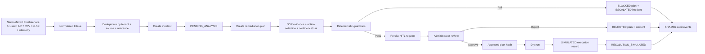
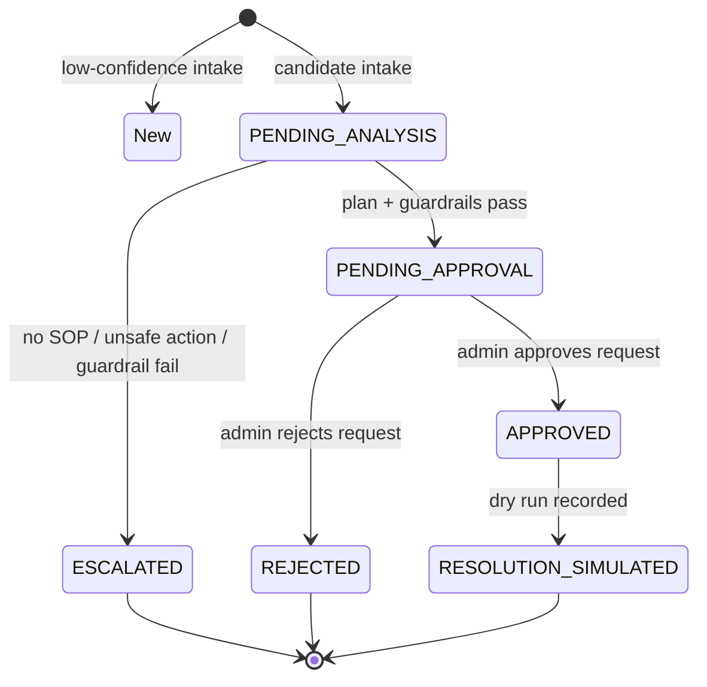

# Current End-to-End Flow — Universal HITL Incident Automation

**Branch:** `feature/universal-hitl-automation`  
**Implementation state:** Current pushed feature-branch behavior  
**Purpose:** Explain exactly what happens from SOP/incident intake to a human-approved, simulated remediation result.

## 1. The core principle

> The application does **not** automatically run a shell command, delete data, restart a service, modify infrastructure, or call a production executor merely because an incident has a high AI/confidence score.

A score provides **evidence**. A remediation action can only progress through a persisted proposed plan, deterministic guardrails, a human approval request, an integrity check against the approved plan hash, and a dry-run record. The currently implemented endpoint completes a simulation only; it has no local command runner and no production HTTP executor implementation.[1]

## 2. System roles and responsibilities

| Component | What it does now | What it never does by itself |
|---|---|---|
| React workspace | Lets an authenticated user see incidents, SOPs, tools, and the existing HITL UI. | It does not grant authorization; the server derives tenant/role from the token. |
| JWT filter and security configuration | Parses the JWT, creates a typed user context containing username, tenant, and role, and limits sensitive endpoints by role. | It does not validate a real external identity-provider token; the branch retains the POC sign-in model. |
| Normalized intake API | Accepts direct JSON, CSV, and XLSX rows, validates them, deduplicates them, and creates a tenant-owned incident. | It does not execute any remediation. |
| Incident service | Adds ticket metadata, computes the existing baseline confidence, and routes candidate incidents to `PENDING_ANALYSIS` instead of an executable state. | It does not convert a high score into an automatic repair. |
| RAG/SOP service | Retrieves SOP evidence used by the proposed-plan flow and answers operator questions. | It does not issue commands to targets. |
| HITL workflow | Creates a candidate tool/action, computes a transparent score/risk value, evaluates guardrails, creates an approval request, and records actions. | It does not run shell code or a production HTTP call. |
| Audit service | Writes SHA-256 hash-chained audit records. | It does not overwrite an audit event through the workflow. |

## 3. End-to-end architecture



## 4. Authentication, tenant, and role flow

### 4.1 Authentication context

The browser sends the bearer token on protected API calls. `JwtAuthFilter` parses the token and requires the subject, `tenantId`, and role claims. It constructs `AuthenticatedUser(username, tenantId, role)` and stores it in Spring Security. Services use `CurrentUser` to obtain those values.[2]

This distinction is important. A request may contain a `tenantId` in a JSON body, file row, query parameter, or client-side display object, but the HITL workflow uses the tenant value from the verified security context. That is the workspace value used for incident ownership, deduplication, plans, approvals, action records, and audit events.[2]

### 4.2 Roles

The code currently enforces the following sensitive-path policy:

| Role | Relevant ability |
|---|---|
| **VIEWER** | Read normal authenticated content; cannot submit intake, generate a plan, approve, or dry-run. |
| **ANALYST** | Submit direct/CSV/XLSX intake and create a proposed plan. |
| **ADMIN** | Analyst permissions plus approve/reject a HITL request, invoke a dry run, use autonomy/admin endpoints, and change platform configuration. |

This means a person who can create an incident is not automatically able to approve the proposed remediation. The approval decision is an administrator action.[3]

## 5. SOP ingestion and SOP question flow

The existing SOP capability works in two forms. An analyst can ingest a short SOP title/description through `POST /api/v1/rag/ingest`, or upload a supported SOP document to `POST /api/v1/rag/upload`. The RAG service stores document chunks in the vector store and associates the chunks with SOP metadata. An operator asks the chat endpoint a question; the RAG service gathers semantic and lexical context and sends a constrained prompt to the configured chat model.[4]

For the new HITL flow, a plan request uses the incident subject and description as an SOP/RAG query. The resulting text becomes `sopEvidence` on the proposed plan. This gives the approver a traceable explanation of the context that influenced the plan. A missing/unavailable SOP result is a guardrail failure, so the system escalates rather than approving an unsupported fix.[1] [5]

> **Current limitation:** The feature branch’s legacy RAG retrieval is not yet fully tenant-filtered at the vector/metadata query layer. The newly created plan and approval records are tenant-owned, but full tenant isolation for historic SOP chunks remains a required follow-up before a multi-tenant production launch.

## 6. Incident intake flow

### 6.1 Direct application API

A third-party system can create an incident with:

```text
POST /api/v1/intake/incidents
```

The body is normalized into the following fields:

| Field | Meaning | Required |
|---|---|---|
| `sourceSystem` | Source name, such as ServiceNow, Prometheus, Dynatrace, Freshservice, or a custom system. | Yes |
| `sourceReference` | Source ticket/alert ID. If absent, the service creates a content fingerprint. | No |
| `subject` | Human-readable incident title. | Yes |
| `description` | Details of the failure; limited to 8,000 characters before persistence. | No |
| `priority` / `severity` | P1–P3 or `CRITICAL`/`HIGH`; normalised to the platform priority scale. | No |
| `category` | Such as network, application, or store device. | No |
| `target` | Submitted external target metadata; the current plan target derives from the incident reference. | No |

The service rejects missing source/subject values and source names over 100 characters or subjects over 500 characters. It derives the tenant from `CurrentUser`, then deduplicates against the combination of tenant, source system, and source reference. If the source reference is absent, a SHA-256 fingerprint of source, subject, and description becomes the reference. A duplicate returns the existing incident rather than creating a second queue item.[6]

### 6.2 CSV and XLSX import

Bulk import uses:

```text
POST /api/v1/intake/incidents/import
Content-Type: multipart/form-data
file=<incidents.csv or incidents.xlsx>
```

The importer accepts up to 500 rows. It reads the first row as a header and expects lower/upper-case-insensitive versions of fields such as `sourceSystem`, `sourceReference`, `subject`, `description`, `priority`, `category`, `target`, and `severity`. Each row goes through the exact same validation and tenant-aware deduplication path as the direct API. The response tells the caller how many rows were created, deduplicated, rejected, and which row numbers failed.[6]

The CSV parser is deliberately simple and intended for conventional comma-separated operational exports. If inputs contain complex quoted multiline cells, the source should use the XLSX endpoint until a full RFC 4180 CSV parser is added.

### 6.3 Existing third-party and telemetry sources

The branch already has ServiceNow/Freshservice/Jira/telemetry-oriented code paths. Direct telemetry creates a normal incident when configured as actionable. Existing external sync maps third-party incident data to `ExternalIncident`. New external records now include the authenticated tenant ID and score them into `PENDING_ANALYSIS` instead of `AUTO_RESOLVED` or an executable queue state.[7]

The scheduler configuration now defaults to a 60-second interval. However, the old keyword-based autonomous executor is intentionally disabled: its `isReady` gate returns false, so it cannot directly run a fixed action from an `APPROVED` or `AUTO_RESOLVED` status.[8]

## 7. Incident state flow



A `PENDING_ANALYSIS` incident is not yet a plan. An analyst must ask the HITL API to create a plan. This prevents a scheduler from silently transforming a high-confidence incident into an action.

## 8. Proposed-plan creation flow

An analyst calls:

```text
POST /api/v1/hitl/incidents/{incidentId}/plan
```

The workflow first checks that the incident belongs to the current tenant. It then checks whether the incident already has an active plan in `PENDING_APPROVAL`, `APPROVED`, or `EXECUTING`; an active plan is treated as a loop condition. Next it performs five steps.[1]

| Step | Current implementation |
|---|---|
| Select a candidate action | Deterministic matching maps printer incidents to `clear-printer-queue`, network/VPN/Wi-Fi incidents to `refresh-network-session`, and offline/service/restart incidents to `restart-approved-service`. Unknown patterns produce no action. |
| Retrieve SOP evidence | The RAG query uses the subject and description and stores the answer as plan evidence. |
| Compute confidence and risk | Uses the requested weighted formula structure. In the first implementation, action match and SOP availability provide pattern/SOP scores; historical-success is zero until execution history is wired in; system health defaults to 0.8; P1/P2/P3 risk penalties are 0.60/0.30/0.10. |
| Evaluate guardrails | Produces a `PASS` or `BLOCK` status plus findings. |
| Persist the plan | Stores the action, target, parameters, SOP evidence, confidence, risk, guardrail findings, rollback statement, plan hash, and audit event. |

The plan hash is SHA-256 over tenant, incident ID, action name, target, and SOP evidence. Any change to those inputs makes the approved hash mismatch and prevents the approved action from progressing.[1]

## 9. Guardrail flow

The following table maps the requested nine guardrails to the current implementation.

| Guardrail | Current behavior | Effect |
|---|---|---|
| 1. Role authorization | Security routes allow analysts/admins to plan; only admins decide or dry-run. | Unauthorized calls receive access denial. |
| 2. Context schema | Intake requires source/subject, bounds key field length, limits description to 8,000 characters, and bulk imports to 500 rows. | Malformed intake is rejected. |
| 3. Prompt-injection / unsafe-content gate | Evidence/action strings are checked for `rm -rf`, `drop table`, `terraform destroy`, `kubectl delete`, shutdown/reboot, prompt-injection phrases, and pipe-to-shell content. | The plan becomes `BLOCKED`. |
| 4. Blast-radius gate | A target must be non-empty, single, and free of wildcard, comma-separated, or `all` target strings. | Broad targeting blocks the plan. |
| 5. Dry run | Every approved request creates a dry-run execution record. | No local system mutation is performed. |
| 6. Rate-limit boundary | One active plan per incident is treated as a loop/duplicate condition. | Parallel plan creation blocks. |
| 7. Loop detector | Existing pending/approved/executing plan causes `LOOP_DETECTED_ACTIVE_PLAN`. | New plan is escalated. |
| 8. Circuit breaker | The legacy autonomous executor is disabled and the current executor is simulation-only. | There is no direct failure-retry loop against a real target. |
| 9. Output schema | Every dry-run record has explicit mode, status, output, and validation result fields. | Unstructured real executor output is not accepted because real executor integration is absent. |

Two informational findings—`DRY_RUN_REQUIRED` and `OUTPUT_SCHEMA_REQUIRED`—are always attached to a safe candidate. Any other finding makes the guardrail result fail. For example, an unrecognized action, a missing SOP, a broad target, or a second active plan results in `BLOCKED`; the incident transitions to `ESCALATED`, and no HITL request is created.[5]

## 10. HITL request and human decision flow

When guardrails pass, the workflow writes a `RemediationPlan` in `PENDING_APPROVAL`, then writes a `HitlRequest` in `PENDING`. The incident becomes `PENDING_APPROVAL`. Two audit events are recorded: `PLAN_CREATED` and `APPROVAL_REQUESTED`.[1]

An administrator retrieves pending requests with:

```text
GET /api/v1/hitl/requests
```

This query is tenant-scoped. The administrator reviews the plan’s action name, target, SOP evidence, confidence score, risk score, guardrail findings, rollback statement, and plan hash. The admin makes a decision through:

```text
POST /api/v1/hitl/requests/{requestId}/decision
{
  "decision": "APPROVE" | "REJECT",
  "reason": "optional reviewer note"
}
```

Only an undecided `PENDING` request can be decided. On approval, the system stores the reviewer, time, decision reason, and the exact `approvedPlanHash`; it sets the request and plan to `APPROVED` and the incident to `APPROVED`. On rejection, it stores the reviewer/reason, sets the request and plan to `REJECTED`, and marks the incident `REJECTED`. In either case it writes a hash-chained audit event.[1]

## 11. Dry-run and execution flow

After approval, an administrator calls:

```text
POST /api/v1/hitl/requests/{requestId}/dry-run
```

The service rechecks all of the important preconditions: request belongs to the active tenant; request status is `APPROVED`; plan still exists; the stored approved hash equals the plan’s current hash; and guardrails still say `PASS`.[1]

If any check fails, the request is stopped with an error. If they pass, it creates an `ActionExecution` record. By default, `mcp.autonomy.execution-enabled` is false, so the record is created with `mode=SIMULATED`, `status=DRY_RUN_PASSED`, and output saying that no system mutation was performed. The plan becomes `SIMULATED`, the incident becomes `RESOLUTION_SIMULATED`, and an `ACTION_EXECUTION / DRY_RUN_COMPLETED` audit event is written.[1] [8]

Even if an operator turns on `execution-enabled`, the current service uses `mode=BLOCKED_HTTP` and records that a separate allow-listed executor is required. There is deliberately no local `Runtime.exec`, SSH, Terraform, ArgoCD, Kubernetes, or HTTP mutation call in this workflow. This is a deliberate safety boundary, not a missing configuration option.[1]

## 12. Audit and persistence flow

The Liquibase migration creates the following key operational tables.

| Table | Current purpose |
|---|---|
| `incident.intake_records` | Reserved durable intake-record model for normalized source evidence. |
| `incident.confidence_logs` | Reserved detailed score-history store. Current plan stores confidence and audit evidence; a follow-up should persist every component score here. |
| `incident.remediation_plans` | Proposed tool/action, evidence, risk, guardrails, rollback text, plan hash, and status. |
| `incident.hitl_requests` | Approval queue request, reviewer, decision reason, and approved hash. |
| `incident.action_executions` | Dry-run or future action result. |
| `incident.audit_events` | Append-only workflow event record with previous hash and current SHA-256 event hash. |

The audit writer gets the latest event hash for a tenant, serializes the event payload, and calculates a new SHA-256 hash over the previous hash plus tenant, aggregate, event, actor, and payload. That creates a per-tenant chain: if a recorded event is changed without recomputing all later hashes, integrity verification will detect it.[9]

> **Important implementation status:** Tenant identifiers and tenant-scoped workflow queries are now in place. PostgreSQL Row-Level Security policies are not yet created. The application layer enforces tenant scope today; database-side RLS is still a production hardening requirement.

## 13. What happens in common scenarios

| Scenario | Result |
|---|---|
| ServiceNow/custom system submits an incident with a known source reference | It creates a tenant-owned incident once; repeat submission returns `DEDUPLICATED`. |
| CSV contains 200 valid incidents and 3 malformed rows | Valid rows create/deduplicate normally; malformed rows are counted and returned with row-number errors. |
| Incident says a printer is offline and matching SOP evidence is found | The planner proposes `clear-printer-queue`, evaluates it, and creates a pending human-approval request if all guardrails pass. |
| Incident asks to destroy infrastructure or SOP text contains `ignore previous instructions` | Guardrails block the plan; the incident is escalated and no approval request is created. |
| Analyst attempts to approve a request | Security blocks it; only an administrator can decide. |
| Admin approves then someone changes action/evidence/target | The plan hash changes; the dry-run endpoint refuses to proceed. |
| Admin invokes dry run | A simulation record is written; no target system is modified. |
| Legacy autonomy scheduler sees an old `AUTO_RESOLVED` incident | The legacy executor is disabled by `isReady() = false`; it does not execute it. |

## 14. Remaining flow work before enterprise production

The current flow is intentionally safe rather than pretending to be fully autonomous. Before production deployment, the following steps are required:

1. **Complete tenant-scoped RAG retrieval.** Vector and lexical SOP retrieval must enforce `tenant_id` at the database/retrieval filter layer.
2. **Wire the existing HITL frontend queue to `/api/v1/hitl`.** The current UI still uses the older incident-status decision endpoint and does not yet display the new plan evidence, hash, guardrail findings, or dry-run record.
3. **Implement source adapters.** ServiceNow, Freshservice, Prometheus, and Dynatrace polling should run under a locked-down system identity and use the normalized intake service. The 60-second scheduler must poll/adapt; it must not execute actions.
4. **Add a separately deployed action executor.** It must independently allow-list action names, enforce target ownership, accept only an approved plan hash, authenticate calls, perform tool-specific dry runs, implement tested rollback runbooks, and return a strict output schema.
5. **Add PostgreSQL RLS policies.** Tenant isolation should be enforced by both services and database roles/tenant session variables.
6. **Persist full confidence components and historical reliability.** Store each score component in `confidence_logs`, compare approved outcomes, and prevent a model from raising score without real evidence.
7. **Replace the POC sign-in with OIDC.** Use validated ID tokens, MFA, lifecycle management, and server-owned role claims.

## References

[1]: file:///home/ubuntu/mcp-incident-automation/src/main/java/com/company/mcp/service/HitlWorkflowService.java "Plan, approval, dry-run, and integrity workflow"
[2]: file:///home/ubuntu/mcp-incident-automation/src/main/java/com/company/mcp/config/JwtAuthFilter.java "JWT-derived authenticated user context"
[3]: file:///home/ubuntu/mcp-incident-automation/src/main/java/com/company/mcp/config/SecurityConfig.java "Endpoint role policy"
[4]: file:///home/ubuntu/mcp-incident-automation/src/main/java/com/company/mcp/service/RagService.java "Existing SOP ingestion and retrieval"
[5]: file:///home/ubuntu/mcp-incident-automation/src/main/java/com/company/mcp/service/GuardrailService.java "Deterministic guardrail evaluation"
[6]: file:///home/ubuntu/mcp-incident-automation/src/main/java/com/company/mcp/service/IncidentIntakeService.java "Direct, CSV, and XLSX normalized intake"
[7]: file:///home/ubuntu/mcp-incident-automation/src/main/java/com/company/mcp/service/IncidentService.java "Incident routing and external source mapping"
[8]: file:///home/ubuntu/mcp-incident-automation/src/main/java/com/company/mcp/service/AutonomousRemediationService.java "Disabled legacy autonomous executor and 60-second scheduler default"
[9]: file:///home/ubuntu/mcp-incident-automation/src/main/java/com/company/mcp/service/AuditService.java "SHA-256 audit hash chain"
