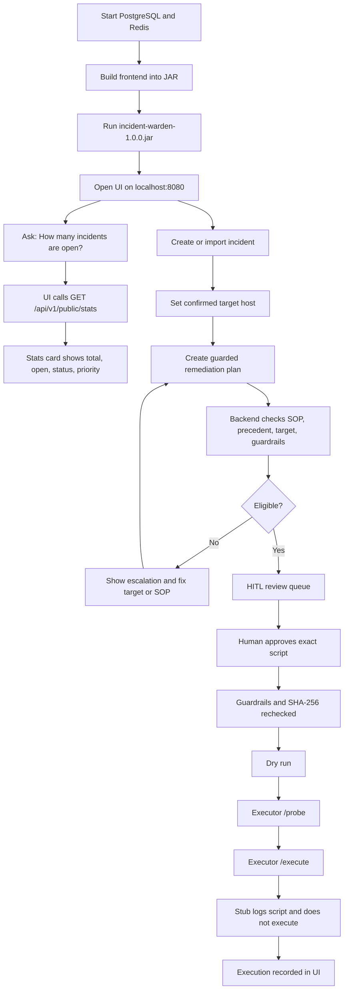

# Incident Warden JAR demo

This is the default lower-environment demo. It uses the packaged JAR and the local executor stub;
the stub accepts requests but never runs a command.

## Start

Create a local environment file from `.env.example`, set the required passwords, then start the
database services:

```bash
cp .env.example .env
docker compose --env-file .env up -d postgres redis
./scripts/run-local.sh
```

Open `http://localhost:8080`. The JAR serves both the React UI and API. In another terminal start
the executor stub:

```bash
node scripts/dev-executor.mjs store-0042-pos-01,store-0042-app-01
```

## Demo flow



## Manual API smoke flow

Use the UI for the normal demo. These calls show the contract when debugging:

```bash
# Public count, no model call
curl -s http://localhost:8080/api/v1/public/stats | jq

# Public search, redacted and read-only
curl -sG http://localhost:8080/api/v1/public/search --data-urlencode 'q=printer' | jq

# Health
curl -s http://localhost:8080/api/health
```

For authenticated flows, sign in through the UI. The browser stores the returned access/refresh
tokens, then `authFetch()` sends the access token to the protected endpoints.

## How generated scripts run

1. The incident target is confirmed or probed. The executor reports its platform; Windows produces
   PowerShell (`.ps1`-style content), and Linux produces Bash content.
2. The plan is created from an approved SOP/procedure, optional precedent, and bounded model output.
3. `GuardrailService` checks the action key, target, script terms, line limit and prompt-injection
   patterns. A human sees the script and its plain-language explanation.
4. Approval stores a SHA-256 hash of the exact script text. Dispatch rejects any changed text and
   scans the text again.
5. Dry run validates the script and asks the executor to probe the target. It does not dispatch the
   script.
6. Live execution sends JSON to the separate executor:

```json
{
  "script": "...exact approved text...",
  "language": "powershell",
  "target": "store-0042-app-01",
  "connection": "WINRM"
}
```

The control plane never invokes `bash`, PowerShell, Python, SSH or `ProcessBuilder`. The executor
owns target credentials, host allowlists and the actual process launch. The repository's
`scripts/dev-executor.mjs` deliberately stops at logging and returns `NOT EXECUTED`.

For a production executor, validate the language against an allowlist, write the approved script to
a non-executable temporary file, execute with a restricted service account and sandbox, enforce a
hard timeout, capture stdout/stderr with secret redaction, record the exit code, and make host and
tenant authorization independent of the control-plane request.

Python is not currently a generated execution language in this repository. If Python support is
added later, use the same approval/hash/guardrail pipeline and invoke only a fixed interpreter path
inside the executor sandbox; never pass generated text to `python -c` or a shell command string.