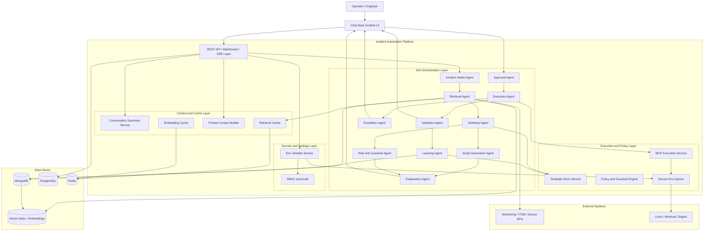
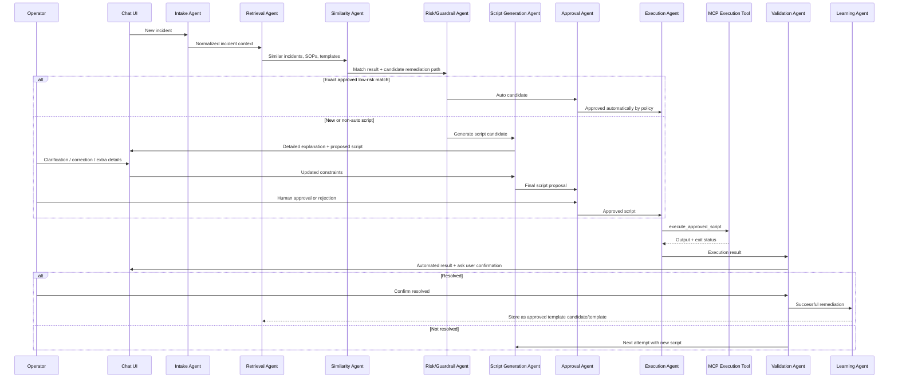
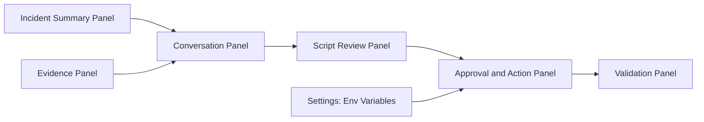

# Final Architecture High-Level Design

## 1. Objective

Design an incident automation platform that:

- uses A2A-style agent orchestration for analysis and decisioning
- exposes a single MCP execution tool for script execution
- uses RAG over resolved incidents, SOPs, and approved remediation templates
- keeps humans in the loop for generated or risky scripts
- auto-executes only approved low-risk operational remediations
- stores secrets and environment variables outside LLM visibility
- uses caching and conversation summarization to reduce token usage

This design replaces broad custom tool sprawl with a controlled execution model centered on one execution capability:

- `execute_approved_script`

---

## 2. Architectural Principles

1. Separate reasoning from execution.
2. Keep the MCP surface minimal.
3. Treat successful scripts as remediation templates, not new tools.
4. Require HITL for all generated or medium/high-risk scripts.
5. Allow auto-remediation only for exact approved low-risk matches.
6. Never expose secret values to the LLM or agent reasoning layer.
7. Use summary memory and retrieval caching to reduce prompt size and token cost.

---

## 3. High-Level Architecture

---

## 4. Main Functional Domains

### 4.1 Incident Collaboration UI

The primary operator experience is a chat-based incident workspace. It supports:

- agent explanations
- operator corrections
- operator-provided context
- script review
- approval and rejection
- post-execution validation
- escalation handoff

### 4.2 A2A Agent Orchestration

The system uses agent roles internally to separate concerns:

- intake
- retrieval
- matching
- generation
- risk evaluation
- explanation
- approval routing
- execution
- validation
- learning
- escalation

This can begin in-process and later evolve into externalized A2A-compatible agents.

### 4.3 MCP Execution Boundary

Only one MCP execution tool is exposed:

- `execute_approved_script`

This keeps the execution surface small, auditable, and policy-driven.

### 4.4 Knowledge and Learning

The system uses:

- resolved incidents
- SOP documents
- approved remediation templates
- execution outcomes
- validation outcomes

Successful remediations are stored as templates or template candidates, not as protocol-level tools.

### 4.5 Security and Secret Isolation

Environment variables and secrets are managed in settings and injected only at execution time.

The LLM can know:

- variable name
- whether it exists
- its scope

The LLM cannot know:

- token value
- password
- API secret
- hidden env content

---

## 5. High-Level Workflow

---

## 6. Automation Policy

### Auto-Execution Allowed

Only for approved low-risk operational remediations such as:

- service restart
- job restart
- safe cache clear

Auto-run requires:

- exact approved template match
- same service and environment profile
- low-risk policy
- no data manipulation
- current guardrail checks passed
- validation plan available
- no recent repeated failures

### HITL Required

- any generated script
- any changed script
- any retry with a different script
- medium-risk actions
- unknown environments

### Manual Escalation

- after 3 failed approved attempts
- high-risk or blocked actions
- repeated policy violations

---

## 7. Data Architecture

### MongoDB

Use for:

- resolved incidents
- SOP-derived knowledge metadata
- script proposals
- approvals
- remediation templates
- execution history
- validation history
- incident conversations
- conversation summaries

### PostgreSQL

Use for:

- transactional app state
- user/tenant metadata
- audit metadata if already present in the current system

### Redis

Use for:

- retrieval cache
- prompt summary cache
- embedding cache
- short-lived approval/session state

---

## 8. UI Architecture

Main features:

- collaborative chat
- evidence visibility
- per-attempt script review
- approve/reject/regenerate actions
- resolution confirmation
- settings page for env variables and secret metadata

---

## 9. Caching Strategy

### Retrieval Cache

Cache retrieval results by:

- normalized incident fingerprint
- service + symptom hash
- SOP query hash

### Conversation Summary Cache

Instead of replaying full chat to the model, maintain:

- confirmed facts
- constraints
- rejected approaches
- approved actions
- pending questions

### Embedding Cache

Cache embeddings for:

- incidents
- SOP chunks
- conversation summaries
- explanations

---

## 10. Security Model

1. Secret values never enter prompts.
2. Secret values are masked in UI after creation.
3. Execution receives secrets only through secure injection.
4. Approval is tied to script hash and target scope.
5. Every execution is fully audited.
6. Human approval is mandatory for generated scripts.

---

## 11. Recommended Delivery Phases

### Phase 1

- chat-based incident page
- script proposal flow
- approval workflow
- remediation template storage

### Phase 2

- retrieval and conversation caching
- summary memory
- env variable settings and secure injection

### Phase 3

- single MCP execution tool
- unified execution service
- low-risk auto-remediation policy

### Phase 4

- formal A2A-style internal agent contracts
- optional externalized agents

---

## 12. Final Target State

The final platform is:

- a chat-first incident remediation workspace
- an A2A-style multi-agent reasoning system
- a single-tool MCP execution boundary
- a guarded learning system for approved remediation templates
- a secure, token-efficient, human-controlled automation platform
