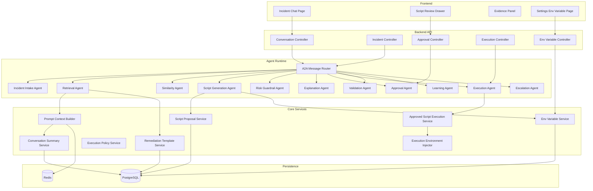
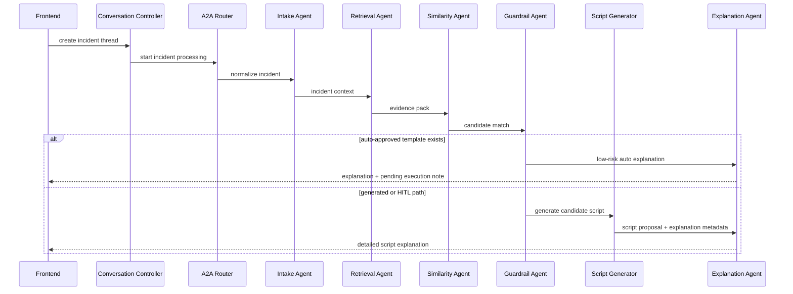
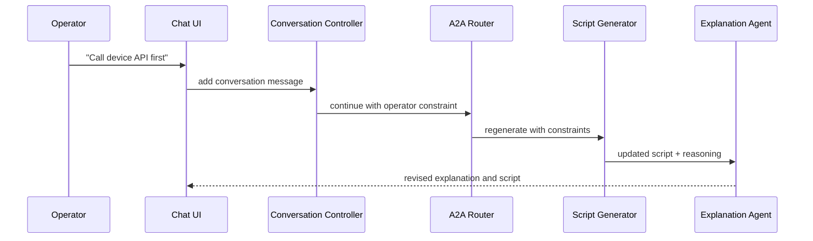
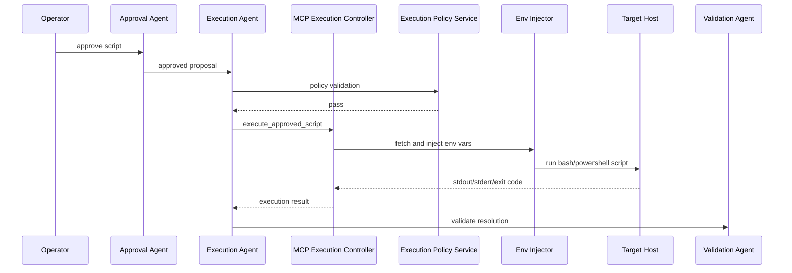
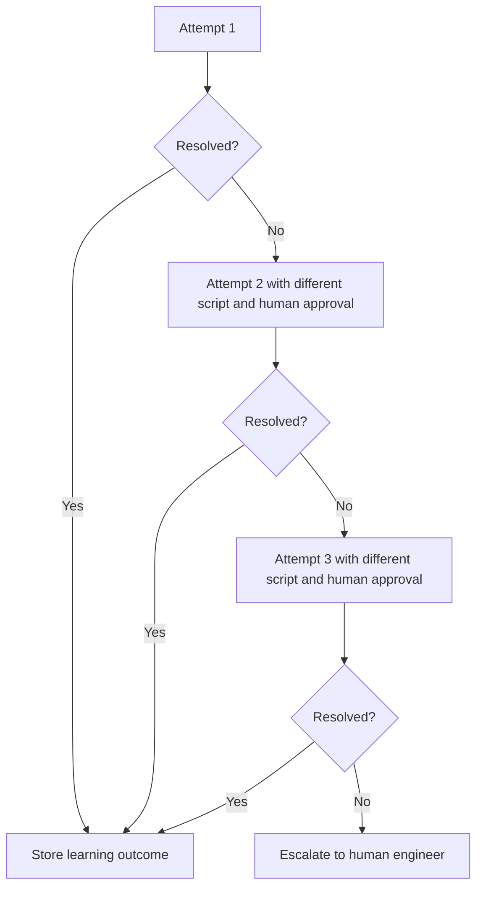
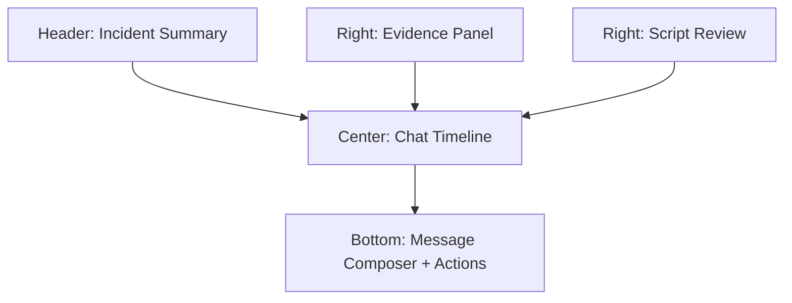

# Final Architecture Low-Level Design

## 1. Scope

This document defines the low-level design for implementing the final architecture with:

- chat-style HITL interaction
- A2A-style internal agent orchestration
- a single MCP execution tool
- RAG and template-driven script generation
- secure env variable handling
- caching and prompt compression
- bounded retry and escalation

---

## 2. Proposed Backend Module Structure

```text
src/main/java/com/company/mcp/
  conversation/
    ConversationController.java
    ConversationService.java
    ConversationSummaryService.java
    ConversationMessage.java
    ConversationThread.java

  remediation/
    RemediationTemplateService.java
    ScriptProposalService.java
    ValidationPlanService.java
    RetryPolicyService.java

  execution/
    ApprovedScriptExecutionService.java
    ExecutionPolicyService.java
    ExecutionEnvironmentInjector.java
    ScriptHashService.java
    ExecutionAuditService.java

  mcp/
    McpExecutionController.java
    McpToolSchemaProvider.java
    McpExecutionRequest.java
    McpExecutionResult.java

  agent/a2a/
    AgentTask.java
    AgentTaskResult.java
    AgentCapability.java
    A2AMessageRouter.java
    A2AAgent.java
    LocalA2AAgentAdapter.java

  agent/roles/
    IncidentIntakeAgent.java
    RetrievalAgent.java
    SimilarityAgent.java
    ScriptGenerationAgent.java
    RiskGuardrailAgent.java
    ExplanationAgent.java
    ApprovalAgent.java
    ExecutionAgent.java
    ValidationAgent.java
    LearningAgent.java
    EscalationAgent.java

  cache/
    RetrievalCacheService.java
    EmbeddingCacheService.java
    PromptContextCacheService.java

  secrets/
    EnvVariableController.java
    EnvVariableService.java
    SecretValueCipher.java
    EnvVariablePolicyService.java

  rag/
    IncidentRetrievalService.java
    SopRetrievalService.java
    TemplateRetrievalService.java
    PromptContextBuilder.java

  model/
    conversation/
    remediation/
    execution/
    secrets/
```

---

## 3. Logical Component Diagram



---

## 4. Core Runtime Flow

### 4.1 New Incident Flow



### 4.2 Human Correction Flow



### 4.3 Execution Flow



---

## 5. Data Model

### 5.1 Conversation Thread

```json
{
  "_id": "thread_id",
  "incident_id": "incident_id",
  "tenant_id": "tenant_id",
  "status": "ACTIVE",
  "current_attempt": 1,
  "created_at": "2026-03-17T10:00:00Z",
  "updated_at": "2026-03-17T10:30:00Z"
}
```

### 5.2 Conversation Message

```json
{
  "_id": "message_id",
  "thread_id": "thread_id",
  "role": "agent",
  "message_type": "explanation",
  "content": "Restarting Tomcat is recommended because...",
  "structured_payload": {
    "constraints": [],
    "evidence_refs": ["incident_11", "sop_4"],
    "proposal_id": "proposal_1"
  },
  "created_at": "2026-03-17T10:01:00Z"
}
```

### 5.3 Script Proposal

```json
{
  "_id": "proposal_id",
  "thread_id": "thread_id",
  "attempt_no": 1,
  "shell": "bash",
  "script": "systemctl restart tomcat",
  "script_hash": "sha256:...",
  "risk_level": "LOW",
  "generated": true,
  "approval_required": true,
  "rollback_plan": "restart previous service state",
  "validation_plan": [
    "GET /health = 200"
  ],
  "status": "PENDING_APPROVAL"
}
```

### 5.4 Remediation Template

```json
{
  "_id": "template_id",
  "name": "restart_tomcat_low_risk",
  "service": "billing-api",
  "environment": "prod",
  "fingerprint": "exact_match_hash",
  "action_class": "restart_service",
  "shell": "bash",
  "script": "systemctl restart tomcat",
  "script_hash": "sha256:...",
  "risk_level": "LOW",
  "auto_eligible": true,
  "data_manipulation": false,
  "success_count": 8,
  "failure_count": 0,
  "last_used_at": "2026-03-17T09:00:00Z"
}
```

### 5.5 Env Variable Metadata

```json
{
  "id": "env_1",
  "key": "DEVICE_API_TOKEN",
  "scope": "TENANT",
  "secret": true,
  "target_environment": "prod",
  "created_by": "admin@company.com",
  "updated_at": "2026-03-17T08:00:00Z",
  "enabled": true
}
```

Secret value storage must be encrypted and stored separately from plain metadata.

---

## 6. API Design

### 6.1 Conversation APIs

#### `POST /api/v1/conversations`

Creates a conversation thread for an incident.

Request:

```json
{
  "incidentId": "inc_123",
  "tenantId": "tenant_a"
}
```

#### `POST /api/v1/conversations/{threadId}/messages`

Adds an operator or agent message.

Request:

```json
{
  "role": "user",
  "messageType": "constraint",
  "content": "Call device inventory API before generating script"
}
```

#### `GET /api/v1/conversations/{threadId}`

Returns thread, messages, latest proposal, latest status, evidence summary.

### 6.2 Approval APIs

#### `POST /api/v1/approvals/{proposalId}/approve`

#### `POST /api/v1/approvals/{proposalId}/reject`

#### `POST /api/v1/approvals/{proposalId}/regenerate`

### 6.3 Validation APIs

#### `POST /api/v1/conversations/{threadId}/validation`

```json
{
  "resolved": true,
  "comment": "Service healthy now"
}
```

### 6.4 Env Variable APIs

#### `POST /api/v1/settings/env-vars`

```json
{
  "key": "DEVICE_API_TOKEN",
  "value": "secret-value",
  "secret": true,
  "scope": "TENANT",
  "targetEnvironment": "prod"
}
```

#### `GET /api/v1/settings/env-vars`

Returns only metadata, never secret values.

#### `PUT /api/v1/settings/env-vars/{id}/rotate`

Rotates the value.

---

## 7. MCP Tool Design

Expose one MCP tool:

- `execute_approved_script`

### Request Schema

```json
{
  "proposal_id": "proposal_1",
  "script_hash": "sha256:...",
  "shell": "bash",
  "target": {
    "type": "host",
    "value": "app-01"
  },
  "script": "systemctl restart tomcat",
  "approval_id": "approval_1",
  "timeout_seconds": 300,
  "env_var_refs": ["DEVICE_API_TOKEN", "DEVICE_API_BASE_URL"]
}
```

### Response Schema

```json
{
  "status": "SUCCESS",
  "exit_code": 0,
  "stdout": "service restarted",
  "stderr": "",
  "started_at": "2026-03-17T10:15:00Z",
  "duration_ms": 4200
}
```

### Validation Rules

1. `proposal_id` must exist.
2. `script_hash` must match approved script.
3. approval must be valid when required.
4. target must be within allowed scope.
5. env vars are injected by reference only.
6. secret values are never returned in logs or prompt context.

---

## 8. Caching and Token Optimization

### 8.1 Retrieval Cache Keys

```text
incident:fingerprint:{hash}
incident:service_symptom:{hash}
sop:query:{hash}
template:match:{hash}
```

### 8.2 Prompt Summary Object

```json
{
  "incident_summary": "Billing API timeouts after deployment",
  "confirmed_facts": [
    "Service is billing-api",
    "Target OS is Linux"
  ],
  "operator_constraints": [
    "Do not restart DB",
    "Use device inventory API first"
  ],
  "rejected_actions": [
    "Rollback deploy"
  ],
  "current_attempt": 2
}
```

### 8.3 Prompt Construction Rules

Prompt should be built from:

1. latest incident summary
2. compact evidence summary
3. operator constraints
4. last 3-5 recent messages
5. current proposal context

Avoid sending:

1. full historical chat every time
2. raw logs unless required
3. large SOP text if already summarized

---

## 9. Secret and Env Variable Design

### 9.1 Storage Strategy

Store env variables as:

1. metadata in application database
2. encrypted secret value in secure storage

Optional runtime sync:

- Unix shell env injection
- Windows PowerShell env injection

These should be injected only inside execution runtime, not agent reasoning.

### 9.2 Access Rules

#### Agent-visible

- key name
- scope
- existence status

#### Agent-hidden

- secret value
- decrypted payload

#### Execution-visible

- secret value only during approved script execution

---

## 10. Retry and Escalation Logic



Rules:

1. retry scripts must be materially different
2. every changed script requires approval
3. stop after 3 failed attempts
4. escalation package must include all tried scripts and outputs

---

## 11. Frontend Design

### 11.1 New Pages and Components

Add:

- `IncidentChatPage.tsx`
- `ConversationTimeline.tsx`
- `EvidencePanel.tsx`
- `ScriptReviewPanel.tsx`
- `ApprovalActions.tsx`
- `ValidationActions.tsx`
- `EnvVariableSettingsPage.tsx`
- `EnvVariableForm.tsx`

### 11.2 Incident Chat Page Layout



### 11.3 Frontend State Model

State should include:

- thread metadata
- messages
- evidence summary
- current proposal
- approval state
- validation state
- retry count

---

## 12. Recommended Implementation Order

### Stage 1

- conversation entities and APIs
- chat incident page
- script proposal review flow

### Stage 2

- remediation template service
- approval and validation services
- retry and escalation

### Stage 3

- secure env variable management
- execution-time env injection
- caching and summary memory

### Stage 4

- single MCP execution endpoint
- policy-driven auto-remediation
- formal A2A router abstraction

---

## 13. Final Implementation Notes

1. Keep the current orchestrator initially, but introduce A2A-style task contracts around it.
2. Unify all execution through `ApprovedScriptExecutionService`.
3. Do not create a new MCP tool for each learned script.
4. Persist successful remediations as templates with strict promotion rules.
5. Make the chat page the main operational UI, not a secondary widget.
