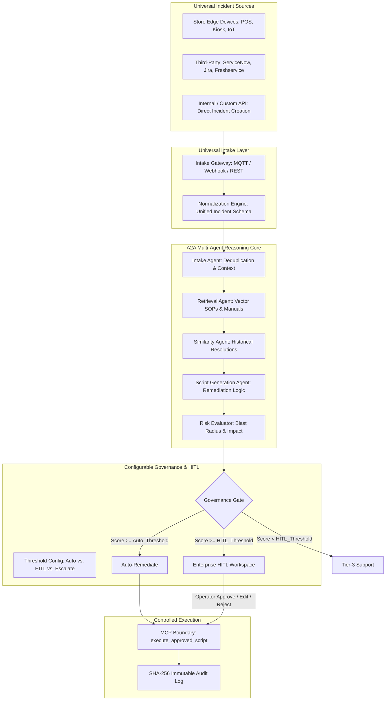

# Enterprise Architecture & UI Proposal: Multi-Agent Human-in-the-Loop (HITL) Universal Monitoring and Remediation Platform

## 1. Executive Summary & Codebase Assessment

The `mcp-incident-automation` repository provides a robust backend foundation built with Spring Boot 3.3, Spring AI, PostgreSQL (pgvector), and Redis. However, to support **enterprise-level store device monitoring and universal issue integration**, the platform requires a shift from static ITSM polling to a **Universal Incident Intake** model with **Configurable Governance**.

The current implementation lacks:
1. **Universal Telemetry Ingestion**: A unified gateway for both physical store devices (POS, Kiosks) and third-party software incidents (ServiceNow, Jira, Custom APIs).
2. **Configurable Confidence Thresholds**: Dynamic governance knobs to adjust Auto-Remediation vs. HITL routing per tenant or issue category.
3. **Enterprise HITL Workspace**: A collaborative command center for reviewing, editing, and approving remediation actions.

---

## 2. Universal Enterprise Architecture

The platform is designed to be **issue-agnostic**, allowing the integration of any hardware or software failure through a standardized intake pipeline.

### 2.1 Multi-Agent Pipeline with Universal Intake

### 2.2 Core Component Mapping

| Architectural Layer | Existing Codebase State | Universal Enterprise Requirements |
| :--- | :--- | :--- |
| **Universal Intake** | Limited ServiceNow/Freshservice polling. | **Standardized REST/Webhook API** to ingest any issue. Native connectors for Jira, ServiceNow, and Store Edge (MQTT). |
| **Governance Engine** | Hardcoded logic in `IncidentService.java`. | **Dynamic Thresholds**: Configurable `autoResolveThreshold` and `hitlThreshold` per issue category (e.g., POS hardware vs. DB software). |
| **Remediation Logic** | Mocked script execution. | **Actionable Remediation**: Real Ansible/SSH/API scripts executed through a secure MCP boundary. |

---

## 3. Enterprise HITL & Configuration UI

The UI provides both operational remediation and administrative governance control.

### 3.1 Configurable Governance UI
The **AI Configuration Page** (`AiConfigPage.tsx`) is expanded to manage global and per-category thresholds:
- **Auto-Resolve Threshold**: Confidence score (0-100%) required for zero-touch remediation.
- **HITL Approval Threshold**: Confidence score required to enter the human review queue.
- **Blast Radius Limit**: Maximum percentage of store devices affected before forcing human intervention.

### 3.2 Store Device & Universal HITL Command Center
An immersive workspace for operators to manage incidents from all sources:
- **Incident Summary**: Metadata from Store Edge or Third-Party (ServiceNow ID, Jira Key).
- **Reasoning Evidence**: Why the agent recommended this action (92% match to SOP #12).
- **Interactive Diff**: Edit generated scripts directly in the UI before approval.
- **Execution Stream**: Real-time terminal output of the remediation action.

---

## 4. Implementation Roadmap

### Phase 1: Universal Intake & Schema
- Standardize the `Incident` model to include `sourceSystem` (Edge, Jira, SNOW) and `category` (Hardware, Network, App).
- Add a generic `POST /api/v1/incidents` endpoint for external issue creation.

### Phase 2: Dynamic Governance
- Move confidence thresholds from hardcoded values to the `SystemConfig` database table.
- Update `IncidentService` to fetch these thresholds dynamically during the reasoning loop.

### Phase 3: HITL Workspace
- Implement the `HitlApprovalQueue.tsx` with support for multi-source incidents.
- Add a "Script Editor" component to the approval flow for manual human refinements.

---

## 5. References

1. Spring AI Documentation. [https://docs.spring.io/spring-ai/reference/](https://docs.spring.io/spring-ai/reference/) [1]
2. PostgreSQL pgvector. [https://github.com/pgvector/pgvector](https://github.com/pgvector/pgvector) [2]
3. MCP Incident Automation Platform. [Internal Repository `iamsouviki/mcp-incident-automation`] [3]
