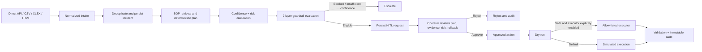

# Universal HITL Automation — Branch Analysis and Safe Implementation Design

## Branch baseline

The `feature/universal-hitl-automation` branch already includes three useful foundations: direct telemetry intake, an incident-confidence field with threshold routing, and a scheduled autonomous-remediation service. However, these foundations do not yet implement the requested safety architecture.

| Requested capability | Current branch behavior | Gap that must be closed |
|---|---|---|
| SOP-backed resolution | RAG is available, but the autonomous loop selects fixed commands from incident-keyword matching. | The action plan must use approved SOP evidence and record the matched source. |
| CSV/XLSX/direct incident intake | Direct telemetry JSON and limited ITSM polling exist. | A normalized batch-import API is missing; spreadsheet data cannot enter the queue safely. |
| Human approval | A UI can move an incident to APPROVED/REJECTED. | There is no durable request carrying the proposed tool, guardrail findings, rollback plan, or approval identity. |
| Auto-remediation governance | `AUTO_RESOLVED` is an executable scheduler state. | The scheduler can execute fixed actions without a persisted, reviewable plan or a complete safety gate. |
| Nine guardrails | Some configuration values exist. | The requested control layers are not implemented or evidenced per action. |
| Immutable audit trail | Execution-log rows are mutable operational records. | There is no SHA-256 hash chain or separately modelled audit event. |
| Multi-tenancy | The branch carries user tenant fields only. | Incident, intake, plan, approval, and audit records require tenant ownership and tenant-scoped retrieval. |

## Safety decision

> No incident may result in a real remediation action merely because an LLM, a keyword matcher, a confidence score, or a scheduler selected it. The system creates a proposed action plan, evaluates deterministic guardrails, and routes it to human approval. The default executor remains simulated and fails closed for any production mode that lacks an explicitly approved, allow-listed executor.

## Minimal durable workflow



The implementation will add a normalized `IncidentIntakeRecord`, `RemediationPlan`, `HitlRequest`, `AuditEvent`, and `ActionExecution` model. Each record is tenant-owned. A plan becomes executable only when it is in `APPROVED` status, its guardrail result is `PASS`, its plan hash has not changed since approval, and execution mode is explicitly enabled. A plan that fails any check becomes `BLOCKED` or `ESCALATED`; it does not retry arbitrary commands.

## Confidence model

The branch will persist a transparent score using the requested formula:

```text
score = (0.35 × patternSimilarity)
      + (0.25 × historicalSuccess)
      + (0.20 × sopReliability)
      + (0.15 × systemHealth)
      - riskPenalty
```

The first implementation uses defensible deterministic defaults where data is not yet available: SOP evidence determines similarity/reliability, successful prior executions determine historical success, system health defaults conservatively, and priority/destructive patterns raise risk. The score is evidence, not permission: all proposed plans enter HITL unless an explicit future policy enables no-touch execution.

## Nine guardrail layers

| Layer | Initial enforcement |
|---|---|
| Role authorization | Only analysts/admins can create plans; only admins can approve or execute. |
| Context schema | Intake records and plans require validated required fields and bounded sizes. |
| Prompt injection | SOP text is treated as data; unsafe instruction phrases and untrusted commands generate a block. |
| Blast radius | A plan may target only one named target; broad/wildcard/multi-target values block it. |
| Dry run | Every approval path runs a dry-run record before any configured executor call. |
| Rate limiting | One active action per incident and a bounded plan creation rate per tenant. |
| Loop detection | A repeated incident/plan fingerprint blocks after the configured attempt threshold. |
| Circuit breaker | Executor failures open a local fail-closed circuit and escalate instead of retrying indefinitely. |
| Output schema | An executor response must be a bounded structured success/failure result; otherwise it fails validation. |

## Execution boundary

The application will **not** execute shell code directly. The only future production path is an allow-listed HTTP executor endpoint that receives an approved plan ID, action name, target, parameter map, and plan hash. The executor must independently enforce its own action allow-list and return the defined output schema. The app’s default is `SIMULATED`; `HTTP` execution must remain disabled until external executor, credentials, network egress, and change-control design are approved.
